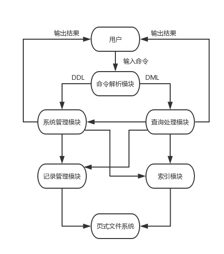

# 数据库系统概论 项目报告

计54 徐毅 (2015011334)  
计54 阎世宏 (2015011316)

## 概述与系统架构

我们基于 Stanford CS 346 Redbase 项目的框架 (以下简称“框架”)，实现了一个单用户的关系数据库管理系统 RippleDB，系统架构如下：

其中，页式文件系统完全由框架提供，我们主要基于框架实现了记录管理模块、索引模块、系统管理模块、查询处理模块和命令解析模块，从而实现了全部基本功能。

此外，我们还实现了以下附加功能：扩展数据类型、外键约束、聚集查询、分组聚集查询、模糊查询、多表连接与查询优化。

## 功能说明

下面具体描述系统支持的功能与相应的 SQL 语句。

### DDL

TODO

### DML

TODO

## 主要模块设计

首先说明一下全局定义部分 (`global.h`, `attr.cc`, `rid.cc`)，包括了各模块所需的常量，数据类型及其比较函数，运算符表，RID 类 (RID 包括页号和槽号，是一个记录的唯一标识) 等。

为处理 NULL，在一条记录的数据中，并非由各属性数据直接拼接而成，而是在各属性数据前增加 1 字节表示该属性是否为 NULL。对于字面量的解析也使用了同样的处理方式。

下面依次介绍各主要模块的设计。

### 记录管理模块

记录管理模块主要用于管理存储记录的文件，其依赖于框架提供的页式文件系统 (`pf.h`, `pf_internal.h`, `pf_error.cc`, `pf_manager.cc`, `pf_filehandle.cc`, `pf_pagehandle.cc`, `pf_buffermgr.h`, `pf_buffermgr.cc`, `pf_hashtable.h`, `pf_hashtable.cc`)。

#### 本模块代码说明

- `rm.h`：记录管理模块声明。
- `rm_error.cc`：记录管理模块错误输出。
- `rm_manager.cc`：记录文件管理器，提供创建指定文件名和单条记录大小的记录文件、删除指定文件名的记录文件、打开指定文件名的记录文件并返回记录文件操作接口、关闭记录文件操作接口的接口。
- `rm_filehandle.cc`：记录文件操作接口，提供根据 RID 查找 / 删除 / 更新记录、插入新记录并返回 RID 的接口。
- `rm_filescan.cc`：记录文件扫描器，绑定于一个记录文件操作接口，提供创建扫描、返回下一个满足条件的记录、关闭扫描的接口。
- `rm_record.cc`：记录类，包括数据指针和 RID。

#### 记录文件存储结构

记录文件分页存储，对于空闲页使用链表记录，对于页内各槽是否空闲使用 bitmap 标记，故有了下面的存储结构。

记录文件的首页存储文件头，包括单条记录大小 (定长)、每页记录条数、首个空闲页号 (即链表头)、每页标记各槽是否空闲的 bitmap 大小。

记录文件的其余页首先包括一个页头，包括下个空闲页号 (即链表的 next 指针)、标记各槽是否空闲的 bitmap，接下来就是定长的各条记录数据。

### 索引模块

索引模块主要用于为记录文件的某个属性建立 B+ 树索引以加快查询速度，其同样依赖于框架提供的页式文件系统。

TODO

### 系统管理模块

系统管理模块主要用于完成 DDL 语句对应的操作，核心是维护系统表，其中打印表操作使用了框架提供的打印辅助类 (`printer.h`, `printer.cc`)。

#### 本模块代码说明

- `sm.h`：系统管理模块声明。
- `sm_error.cc`：系统管理模块错误输出。
- `sm_manager.cc`：系统管理器，提供创建 / 删除 / 打开指定名字数据库、显示数据库列表、关闭当前数据库、显示当前数据库内表的列表、创建 / 删除 / 描述 / 打印指定名字表、创建 / 删除指定名字表和属性的索引的接口。
- `sm_internal.cc`：系统表 RelCat 与 AttrCat 对应的类。

#### 系统表结构

##### 表之表 RelCat

- relName：表名。
- tupleLength：单条记录大小。
- attrCount：属性个数。
- indexCount：下一新建索引编号。

##### 属性之表 AttrCat

- relName：表名。
- attrName：属性名。
- offset：属性相对于记录数据指针的偏移。
- attrType：属性类型。
- indexNo：属性对应的索引编号 (无索引时为 -1，否则 indexNo 对应非 NULL 值的索引编号，indexNo + 1 对应 NULL 值的索引编号)。
- isNotNull：属性是否要求非空。
- primaryKey：属性是第几个主键 (非主键则为 0)。
- refrel：外键表名 (非外键则为 "")。
- refattr：外键属性名 (非外键则为 "")。

### 查询处理模块

查询处理模块主要用于完成 DML 语句对应的操作，核心是 xxxx。

TODO

### 命令解析模块

命令解析模块主要用于解析用户在命令行界面输入的 DDL 与 DML 语句，并调用对应的系统管理模块与查询处理模块的接口完成操作。

在框架中提供了 Redbase 项目的命令解析模块，但由于本项目的 SQL 语句与 Redbase 项目差别较大，我们在沿用其基本组织方式与一些通用工具函数的基础上，进行了较大的改动。

#### 本模块代码说明

- `scanhelp.c`：词法分析工具函数，被词法分析器直接包含，用于为字面量分配内存、标识符转小写、区分关键字等。
- `scan.l`：词法分析描述文件，供 flex 生成词法分析器，主要任务是解析出所有终结符 (字面量、关键字、标识符)。
- `parser_internal.h`：抽象语法树结点声明。
- `nodes.c`：抽象语法树结点定义，隐去了语法分析中对语义无影响的部分。
- `parse.y`：语法分析描述文件，供 bison 生成语法分析器，主要任务是建立抽象语法树。
- `parser.h`：解析结果类型声明，作为系统管理模块与查询处理模块的接口参数使用。
- `interp.c`：语义分析器，遍历抽象语法树产生解析结果类型，调用系统管理模块与查询处理模块的接口完成实际的语义动作。

## 附加功能实现

### 扩展数据类型

为统一起见，直接对所支持的 4 种数据类型进行介绍。

- int：定长为 4 字节。
- varchar：定长为建表时规定的长度上限，内部以 `\0` 作为字符串真正的结尾。
- float：定长为 4 字节，需要注意的是 float 允许接收 int 字面量。
- date：定长为 11 字节，以字符串形式存储，需要注意的是 date 一定接收的是 varchar 字面量，并需要对日期合法性进行判断。

### 外键约束

### 聚集查询

除命令解析模块的支持外，TODO。

### 分组聚集查询

除命令解析模块的支持外，TODO。

### 模糊查询

除命令解析模块的支持外，还增加了模糊比较运算符，其内部实现为一个动态规划。

对于原始模式串 $originalPattern$ 和文本串 $text$，首先将原始模式串中的 `%` 变为特殊功能码 `\1`，`_` 变为特殊功能码 `\2`，转义字符 `\<char>` 变为真实字符 `<char>`，从而产生真正的模式串 $pattern$，各字符只占一个字节以方便动态规划的进行。

令 $possible(i, j)$ 表示 $pattern[1..i]$ 与 $text[1..j]$ 是否可能匹配，则初始条件为
$$ possible(0, j) = \begin{cases}
true & j = 0 \\
false & others
\end{cases}
$$
$i > 0$ 时，
$$ possible(i, 0) = \begin{cases}
possible(i - 1, 0) & pattern[i] = 1 \\
false & others
\end{cases}
$$
$i > 0, j > 0$ 时，
$$
possible(i, j) = \begin{cases}
possible(i - 1, j) \lor possible(i - 1, j - 1) \lor possible(i, j - 1) & pattern[i] = 1 \\
possible(i - 1, j - 1) & pattern[i] = 2 \lor pattern[i] = text[j] \\
false & others
\end{cases}
$$

### 多表连接与查询优化

TODO

## 实验结果

TODO

## 小组分工

这里仅标明相应模块的主要负责人。

1. 记录管理模块：徐毅
2. 索引模块：阎世宏
3. 系统管理模块：徐毅
4. 查询处理模块：阎世宏
5. 命令解析模块：徐毅

## 总结收获

1. 除去框架文件，整个项目代码量近 9000 行，大小近 300 KB，伴随了我们整整一个学期，对我们的代码能力是一种极大的锻炼。
2. 最初只是依次实现一个个模块，感觉还不是太明显，但当最后合在一起成功跑起来这个数据库的时候，成就感还是爆棚的。
3. 构建一个鲁棒的系统是相当不容易的，需要进行各种类型的大量的测试。
4. 总体收获颇丰，希望这门课越办越好。

## 参考文献

[1] Stanford CS 346 课程主页. https://web.stanford.edu/class/cs346/2015/

[2] Stanford CS 346 Redbase 项目的框架文件来源 (切换到 initial commit 等可获取). https://github.com/junkumar/redbase